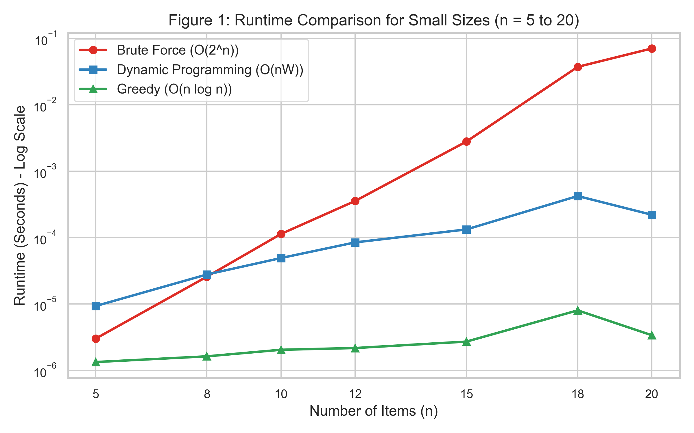
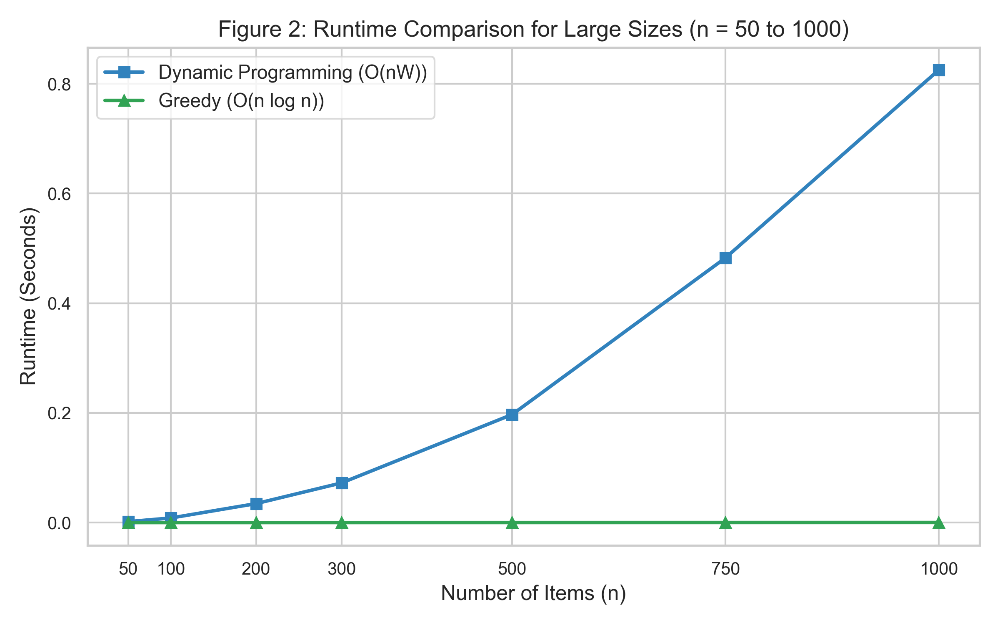
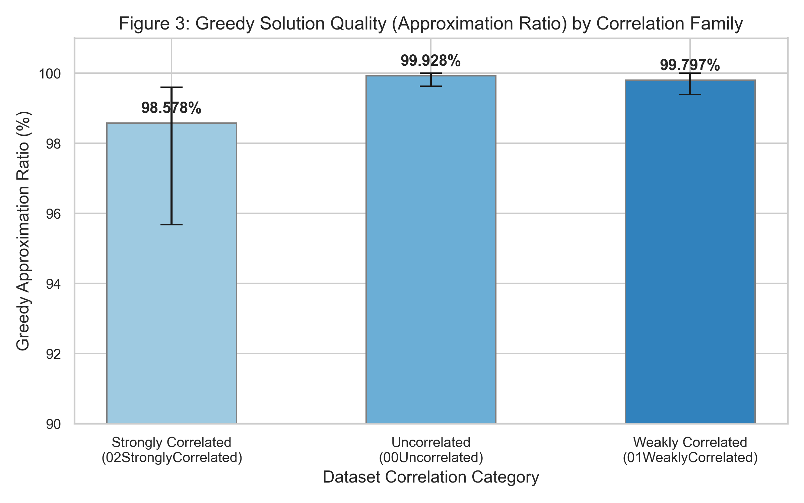

# Comparative Empirical Analysis of Exact and Heuristic Algorithms for the 0/1 Knapsack Problem

<div style="text-align: center; font-family: 'Helvetica Neue', Helvetica, Arial, sans-serif; font-size: 9.5pt; color: #555555; margin-top: -5px; margin-bottom: 5px;">
  <strong>Course:</strong> CSE 401 - Design and Analysis of Algorithms &nbsp;&bull;&nbsp; 
  <strong>Institution:</strong> Institute of Business Administration (IBA), Karachi
</div>

<h3 class="group-members">
  <strong>Saad Inam</strong> (ERP: 29068) &nbsp;&bull;&nbsp; 
  <strong>Shaheer Shahid</strong> (ERP: 29053) &nbsp;&bull;&nbsp; 
  <strong>Hassan Jabbar</strong> (ERP: 29060)
</h3>

---

## Abstract
The $0/1$ Knapsack Problem is a classic NP-hard combinatorial optimization problem with applications in resource allocation, portfolio selection, and cryptography. The problem is also conceptually linked to practical sales operations, such as the Traveling Salesperson Problem (TSP); before a salesperson departs on their tour, they must solve a knapsack problem to figure out what items or goods to carry, because a salesperson without their goods is not a good salesperson. This report presents a comparative empirical analysis of three core algorithms: **Brute Force (Exhaustive Recursion)**, **Dynamic Programming (Bottom-up Tabulation)**, and a **Greedy Approximation Heuristic (Value-to-Weight Ratio Sort)**. We evaluate these algorithms across synthetic datasets, standard benchmark datasets from the `kplib` library, and large-scale hard benchmarks. Our findings confirm that Brute Force exhibits exponential time growth $O(2^n)$, becoming intractable for $n > 20$. Dynamic Programming guarantees optimal solutions in pseudo-polynomial time $O(nW)$, but suffers from memory constraints when capacity $W \ge 10^8$. The Greedy heuristic executes in $O(n \log n)$ time, achieving an average approximation ratio above $99\%$ on most instances, though its quality degrades to $95.68\%$ on strongly correlated datasets where profit is tightly coupled with weight. We analyze these computational trade-offs to guide algorithmic selection.

---

## 1. Problem Statement
Given $n$ items, where each item $i$ ($1 \le i \le n$) has a profit $p_i > 0$ and weight $w_i > 0$, and a knapsack of capacity $W > 0$, select a subset of items to maximize the total profit without exceeding the capacity $W$. Using binary variables $x_i \in \{0, 1\}$, where $x_i = 1$ if item $i$ is selected and $0$ otherwise, the problem is formulated as:
$$\text{Maximize: } \sum_{i=1}^{n} p_i x_i \quad \text{subject to } \sum_{i=1}^{n} w_i x_i \le W$$

### Computational Complexity
* **Decision Version**: Asking if a profit of at least $P$ can be achieved is **NP-complete** (proved by reduction from Subset Sum).
* **Optimization Version**: Maximizing profit is **NP-hard**. The search space consists of $2^n$ subsets. However, if $W$ is bounded, it can be solved in pseudo-polynomial time $O(nW)$ using Dynamic Programming.

---

## 2. Description of Algorithms Used

### 2.1 Brute Force (Exhaustive Recursive Search)
* **Technique**: Explores the full binary decision tree via recursion.
* **Recurrence Relation**:
  $$K(i, c) = \begin{cases} 
  0 & \text{if } i = 0 \text{ or } c = 0 \\
  K(i-1, c) & \text{if } w_i > c \\
  \max(K(i-1, c), p_i + K(i-1, c - w_i)) & \text{otherwise}
  \end{cases}$$
* **Complexity**: Time: $O(2^n)$, Space: $O(n)$ due to call stack depth.

```python
def knapsack_brute_force(weights, values, capacity, n=None):
    if n is None: n = len(weights)
    if n == 0 or capacity == 0: return 0
    if weights[n - 1] > capacity: return knapsack_brute_force(weights, values, capacity, n - 1)
    return max(knapsack_brute_force(weights, values, capacity, n - 1),
               values[n - 1] + knapsack_brute_force(weights, values, capacity - weights[n - 1], n - 1))
```

### 2.2 Dynamic Programming (Bottom-Up Tabulation)
* **Technique**: Tabulation with space optimization. Uses a 1D array `dp` of size $W+1$. The capacity loop runs backwards from $W$ down to $w_i$ to ensure each item is selected at most once.
* **Complexity**: Time: $O(nW)$, Space: $O(W)$.

```python
def knapsack_dp(weights, values, capacity):
    dp = [0] * (capacity + 1)
    for i in range(len(weights)):
        for w in range(capacity, weights[i] - 1, -1):
            dp[w] = max(dp[w], values[i] + dp[w - weights[i]])
    return dp[capacity]
```

### 2.3 Greedy Approximation Heuristic
* **Technique**: Sorts items descending by profit-to-weight ratio $r_i = p_i / w_i$. The scan adds items until the remaining capacity cannot fit the next item.
* **Complexity**: Time: $O(n \log n)$, Space: $O(n)$.

```python
def knapsack_greedy(weights, values, capacity):
    order = sorted(range(len(weights)), key=lambda i: values[i] / weights[i], reverse=True)
    total, remaining = 0, capacity
    for i in order:
        if weights[i] <= remaining:
            total += values[i]
            remaining -= weights[i]
    return total
```

---

## 3. Details About the Data
We evaluate the algorithms across four test beds:

1. **Synthetic Datasets**: Weights $w_i \in [1, 50]$, values $p_i \in [1, 100]$, and capacity $W = \lfloor 0.4 \sum w_i \rfloor$.
2. **kplib Standard Benchmarks**: Kellerer et al. instances (coefficient range $R = 1000$) across three correlation families:
   * *00Uncorrelated*: $p_i$ and $w_i$ are independent.
   * *01WeaklyCorrelated*: $p_i \in [w_i - R/10, w_i + R/10]$.
   * *02StronglyCorrelated*: $p_i = w_i + R/10$ (highly challenging for greedy ratio-sorting).
3. **Jooken Hard Instances (2022)**: Hard benchmarks with $n \in [400, 1200]$ and capacities $W \in \{10^6, 10^8, 10^{10}\}$.
4. **Synthetic Edge Cases Suite**: Verification suite containing boundary conditions (single item, $W=0$, $W \ge \sum w_i$, capacity less than minimum weight, and a classic greedy failure counterexample).

---

## 4. Details About the Experiments
* **Environment**: Apple Silicon macOS, Python 3.12.
* **Runtimes**: Measured using `time.perf_counter()`. The minimum of 3 runs is recorded.
* **Safety Limits**: Brute Force is skipped for $n > 20$ due to $O(2^n)$ runtime. DP is skipped for $W > 2,000,000$ to prevent Out-Of-Memory (OOM) failures.

---

## 5. Empirical Results

### 5.1 Synthetic Shared Results (Small Sizes, $n \le 20$)
This set evaluates all three algorithms on identical, deterministic inputs.

**Table 1: Small Synthetic Instances (BF vs. DP vs. Greedy)**

| $n$ | Capacity | BF Time | DP Time | Greedy Time | BF Value | DP Value | Greedy Value | Greedy Ratio |
| :---: | :---: | :---: | :---: | :---: | :---: | :---: | :---: | :---: |
| 5 | 46 | 3.00 us | 9.29 us | 1.33 us | 61 | 61 | 61 | 100.00% |
| 8 | 62 | 25.71 us | 27.75 us | 1.62 us | 302 | 302 | 302 | 100.00% |
| 10 | 84 | 113.25 us | 49.12 us | 2.04 us | 356 | 356 | 333 | 93.54% |
| 12 | 121 | 355.46 us | 84.50 us | 2.17 us | 329 | 329 | 329 | 100.00% |
| 15 | 153 | 2.79 ms | 132.37 us | 2.71 us | 522 | 522 | 520 | 99.62% |
| 18 | 166 | 37.12 ms | 421.46 us | 8.00 us | 577 | 577 | 554 | 96.01% |
| 20 | 174 | 70.30 ms | 220.00 us | 3.37 us | 949 | 949 | 949 | 100.00% |

#### Observations
1. **Exponential growth of Brute Force**: Adding one item roughly doubles the runtime, confirming $O(2^n)$ scaling.
2. **DP Efficiency**: For small capacities, DP is highly efficient, executing in under $1$ ms.
3. **Greedy Sub-Optimality**: Greedy fails to find optimal solutions at $n=10$ (ratio $93.54\%$) and $n=18$ (ratio $96.01\%$), but runs in microseconds.

---

### 5.2 Synthetic Large Results ($n \ge 50$)
Brute Force is skipped. Only DP and Greedy are run.

**Table 2: Large Synthetic Instances (DP vs. Greedy)**

| $n$ | Capacity | DP Time | Greedy Time | DP Value | Greedy Value | Greedy Ratio |
| :---: | :---: | :---: | :---: | :---: | :---: | :---: |
| 50 | 473 | 1.77 ms | 8.00 us | 2,005 | 1,991 | 99.30% |
| 100 | 986 | 8.36 ms | 16.38 us | 3,705 | 3,698 | 99.81% |
| 200 | 2073 | 34.65 ms | 33.88 us | 7,117 | 7,117 | 100.00% |
| 300 | 3070 | 72.32 ms | 51.83 us | 10,602 | 10,599 | 99.97% |
| 500 | 4971 | 197.09 ms | 91.88 us | 18,982 | 18,977 | 99.97% |
| 750 | 7651 | 482.77 ms | 142.50 us | 28,049 | 28,046 | 99.99% |
| 1000 | 10334 | 825.34 ms | 193.25 us | 36,613 | 36,613 | 100.00% |

#### Observations
1. **DP Scaling**: Since $W$ scales linearly with $n$ ($W \approx 10n$), DP runtime grows quadratically $O(n^2)$, reaching $825.34$ ms at $n=1000$.
2. **Greedy Scaling & Quality**: Greedy executes in under $200$ us and achieves an approximation ratio close to $100\%$. The relative impact of capacity slack decreases with larger $n$.

---

### 5.3 Correlation Analysis (kplib Standard Benchmarks)
We evaluate the impact of item correlations on algorithm performance.

**Table 3: kplib Benchmarks Grouped by Correlation Family and Size**

| Category | $n$ | Avg DP Time | Avg Greedy Time | Avg Greedy Ratio | Min Greedy Ratio | Max Greedy Ratio |
| :--- | :---: | :---: | :---: | :---: | :---: | :---: |
| **00Uncorrelated** | 50 | 53.69 ms | 8.14 us | **99.99%** | 99.96% | 100.00% |
| | 100 | 172.95 ms | 16.88 us | **99.87%** | 99.63% | 100.00% |
| | 200 | 783.01 ms | 34.76 us | **99.92%** | 99.87% | 99.96% |
| **01WeaklyCorrelated**| 50 | 50.37 ms | 7.89 us | **99.57%** | 99.39% | 99.67% |
| | 100 | 209.78 ms | 15.76 us | **99.85%** | 99.79% | 99.93% |
| | 200 | 779.17 ms | 33.28 us | **99.97%** | 99.94% | 100.00% |
| **02StronglyCorrelated**| 50 | 50.38 ms | 8.18 us | **97.24%** | **95.68%** | 98.12% |
| | 100 | 209.93 ms | 15.63 us | **99.18%** | **98.88%** | 99.34% |
| | 200 | 779.91 ms | 33.92 us | **99.32%** | **98.98%** | 99.60% |

#### Observations
1. **DP Runtime Independence**: DP runtime is unaffected by item correlation, taking $\approx 780$ ms at $n=200$ across all categories, matching the $O(nW)$ theoretical bound.
2. **Greedy Degradation**: Greedy's approximation ratio drops on strongly correlated instances, hitting a minimum of $95.68\%$. Under strong correlation ($p_i = w_i + R/10$), the profit-to-weight ratio $r_i = 1 + R/(10w_i)$ becomes highly sensitive to small variations in weight, leading to poor packing choices that leave empty capacity.

---

### 5.4 Jooken Hard Instances (Large Scale and Massive Capacities)
Evaluating algorithms under massive capacity demands.

**Table 4: Jooken Instances Grouped by Size and Capacity**

| $n$ | Capacity | Count | DP Count (Run) | Avg DP Time | Avg Greedy Time | Avg Greedy Ratio (DP cases) | Min Greedy Ratio |
| :---: | :---: | :---: | :---: | :---: | :---: | :---: | :---: |
| 400 | 1,000,000 | 9 | 9 | 27.20 s | 67.62 us | 99.04% | 95.63% |
| 400 | 100,000,000 | 7 | 0 | *Skipped (OOM)* | 65.92 us | - | - |
| 400 | 10,000,000,000 | 5 | 0 | *Skipped (OOM)* | 71.64 us | - | - |
| 600 | 1,000,000 | 9 | 9 | 42.28 s | 101.63 us | 99.31% | 96.93% |
| 600 | 100,000,000 | 8 | 0 | *Skipped (OOM)* | 116.12 us | - | - |
| 600 | 10,000,000,000 | 5 | 0 | *Skipped (OOM)* | 119.88 us | - | - |
| 800 | 1,000,000 | 7 | 7 | 47.50 s | 138.03 us | 100.00% | 99.99% |
| 800 | 100,000,000 | 5 | 0 | *Skipped (OOM)* | 147.09 us | - | - |
| 800 | 10,000,000,000 | 10| 0 | *Skipped (OOM)* | 148.78 us | - | - |
| 1000 | 1,000,000 | 5 | 5 | 73.78 s | 182.24 us | 99.98% | 99.92% |
| 1000 | 100,000,000 | 1 | 0 | *Skipped (OOM)* | 181.38 us | - | - |
| 1000 | 10,000,000,000 | 9 | 0 | *Skipped (OOM)* | 187.52 us | - | - |
| 1200 | 1,000,000 | 7 | 7 | 72.18 s | 216.17 us | 99.15% | 94.19% |
| 1200 | 100,000,000 | 8 | 0 | *Skipped (OOM)* | 217.59 us | - | - |
| 1200 | 10,000,000,000 | 5 | 0 | *Skipped (OOM)* | 223.01 us | - | - |

#### Observations
1. **DP Limitations**: DP was skipped on $63/100$ instances where $W \ge 10^8$ to prevent OOM errors. For $W = 1,000,000$, DP runtimes were significant (up to $73.78$ s), showing that pseudo-polynomial execution becomes a bottleneck at scale.
2. **Greedy Scalability**: Greedy completed in under $230$ us across all instances, retaining high-quality approximations (avg $99.44\%$, min $94.19\%$).

---

### 5.5 Synthetic Edge Cases Verification

**Table 5: Edge Cases Results**

| Case Name | $n$ | Capacity | BF Time | DP Time | Greedy Time | BF Val | DP Val | Greedy Val | Greedy Ratio |
| :--- | :---: | :---: | :---: | :---: | :---: | :---: | :---: | :---: | :---: |
| **`n1_cap0`** | 1 | 0 | 334.00 ns | 624.98 ns | 834.00 ns | 0 | 0 | 0 | - |
| **`n1_exact`** | 1 | 5 | 584.03 ns | 540.98 ns | 749.98 ns | 10 | 10 | 10 | 100.00% |
| **`cap_equals_sum`** | 3 | 18 | 1.75 us | 3.71 us | 1.08 us | 33 | 33 | 33 | 100.00% |
| **`cap_less_than_min`**| 3 | 4 | 416.01 ns | 542.00 ns | 916.97 ns | 0 | 0 | 0 | - |
| **`greedy_failure_classic`**| 3 | 50 | 1.50 us | 7.13 us | 917.00 ns | 220 | 220 | 160 | **72.73%** |
| **`many_equal_items`** | 4 | 2 | 2.37 us | 1.33 us | 1.04 us | 2 | 2 | 2 | 100.00% |

#### Observations
1. **Verification**: BF and DP match on all instances, validating implementation correctness.
2. **Greedy Failure**: On `greedy_failure_classic` ($W=50$, items: $(60, 10), (100, 20), (120, 30)$), Greedy selects ratio-optimal items $1$ and $2$ yielding $160$, while the global optimal is items $2$ and $3$ yielding $220$. Greedy achieves only $72.73\%$ optimization due to item indivisibility.

---

## 6. Visualization Figures

::: {.figures-container}





:::

---

## 7. Discussion and Analysis
* **Brute Force**: Serves as a correctness baseline; limited by its $O(2^n)$ exponential complexity.
* **Dynamic Programming**: Best for absolute optimality when capacity $W$ is small to moderate. Suffers from high computational and memory $O(W)$ limits when $W \ge 10^8$.
* **Greedy Heuristic**: Runs in $O(n \log n)$ time with $O(n)$ space. Highly scalable, making it the practical choice for real-time or massive instances, though susceptible to correlation-induced sub-optimality.

---

## 8. Conclusion
We evaluated three Knapsack algorithms across synthetic, standard (`kplib`), and large-scale hard benchmarks. Our analysis shows that Brute Force is limited to $n \le 20$, Dynamic Programming is bound by memory when $W \ge 10^8$, and Greedy heuristics scale near-instantly but yield sub-optimal results ($95\%$-$99\%$) depending on dataset correlation. Algorithm selection must balance constraints between optimality requirements and memory budgets.

---

## References
1. Kellerer, H., Pisinger, D., & Toth, P. (2004). *Knapsack Problems*. Springer.
2. Jooken, J., Leyman, P., & De Causmaecker, G. (2022). A new generator for hard 0/1 knapsack instances. *European Journal of Operational Research*, 301(3), 856-869.
3. Pisinger, D. (1995). *Algorithms for Knapsack Problems*. PhD thesis, University of Copenhagen.
4. Pisinger, D., & Saidi, A. (2017). Tolerance analysis for 0–1 knapsack problems. *European Journal of Operational Research*, 258(3), 866-876.
